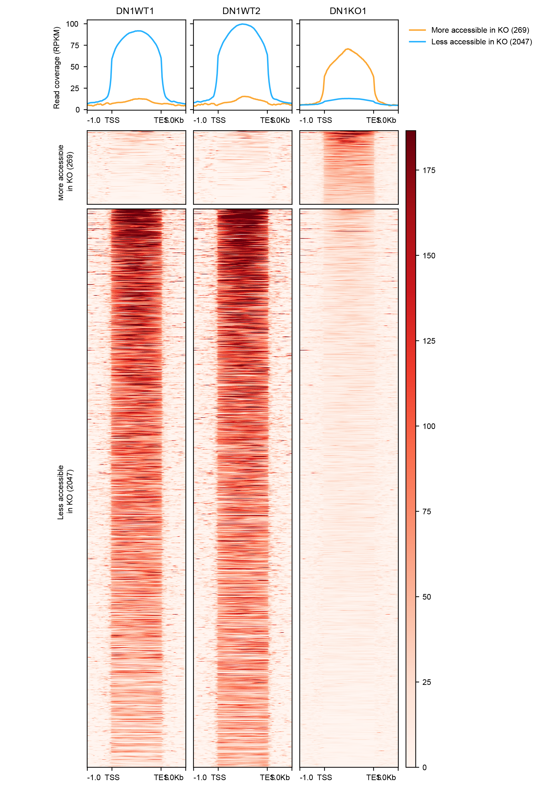

# DN1 ATAC-seq 

We performed ATAC-seq on 50000 DN1 WT and KO DN1 cells obtained from OP-9 co-culture. To perform the experiment, we used [this protocol](docs/Fast-ATAC-seq_MV.docx).
Details of the experiment, such as number of qPCR cycles, index of primers can be found in [this powerpoint](docs/Overview_DN1_ATAC.pptx).

The report of sequencing from Macrogen can be found [here](docs/HN00155645_report_sequencing.pdf).

The analysis was done using our [ATAC Snakemake pipeline](https://git.lumc.nl/dsanleongranado/ATAC-seq-snakemake)

The raw data was archived in the SHARK LTS: `/exports/archive/hg-groep-vandermaarel/Lucia/ATAC_seq/ATAC_Veronica_2021_DN1` 

## Analysis

### Peak calling
With MACS2 peak calling we obtained the peaks identfied for 2xWT and 1xKO:

| name | peaks |
| ---- | ----- |
| WT1  | 28992 |
| WT2  | 24902 |
| KO1  | 37473 |

The peaks and the genome tracks can be found on [UCSC](http://genome-euro.ucsc.edu/cgi-bin/hgTracks?db=mm10&lastVirtModeType=default&lastVirtModeExtraState=&virtModeType=default&virtMode=0&nonVirtPosition=&position=chr6%3A124841162%2D124911751&hgsid=274563084_3DHBVW3a35r0EP6V4SmNVnPDbggR).

### Differential peak analysis
The differential peak analysis was done with [Homer](scripts/Homer_differential_peak_calling.sh), we observed the following differentially expressed peaks:

| type                  | number |
| --------------------- | ------ |
| Less accessible in KO | 2046   |
| More accessible in KO | 269    |


To validate the differential peaks, I made this heatmap:



I annotated the differential peaks:
    - [less accessible](data/Differential_peak_analysis/homer/Homer_differentially_accessible_peaks.xlsx) (Sheet1)
    - [more accessible](data/Differential_peak_analysis/homer/Homer_differentially_accessible_peaks.xlsx) (Sheet2)

### Motif analysis

Using the coordinate of the differential peaks, I performed a motif analysis using HOMER.

The results can be found here:
    - [less accessible](data/motif/less_accessible_in_KO/knownResults.html)
    - [more accessible](data/motif/more_accessible_in_KO/knownResults.html)

The motif analysis is interesting because we can see that amond the TF found in the less accessible loci induced by MORC3 loss, we find Runx1 and Tcf7.     

I used FIMO to identify all the potential binding sites of the follwing TF:

    - TCF7: CCACATCAAAGG
    - RUNX1: CWAACCACAR


 There are 70110 occurences of TCF7 motif genome wide. 
 If we take a window of 1000bp upstream and downstream the less accessible peaks, there are 197 (10%) differentially accessible peaks that overlap with a TCF7motif.


 There are 85689 occurences of the Runx1 motif genome wide. 
  If we take a window of 1000bp upstream and downstream the less accessible peaks, there are 338 (17%) differentially accessible peaks that overlap with a TCF7motif.


# Update January 2022

To complete the experiment we have added few more samples to the experiment. All the raw data for those samples are stored in the archive in this folder:
`/exports/archive/hg-groep-vandermaarel/Lucia/ATAC_seq/ATAC_Veronica_2021_DN1/raw`. Samples of December are in `samples_Dec_2021`. The md5 information about those samples are in the document sent by [Macrogen](docs/HN00163855_Macrogen_ATAC_120122.pdf).

I performed the analysis with the following [pipeline](https://git.lumc.nl/jchouaref/Snakemake_ChIP_seq_pipeline).

The quality of the data is very good for all samples as shown in the [MultiQC](docs/multiqc_report_ATAC_Dec2021.html)

This is a  summary  of the number of peaks identified with MACS2 for every sample:

| name   | peaks | Experiment | without sex chromosomes |
|--------|-------|------------|-------------------------|
| WT1    | 28992 | July 2021  | 28288                   |
| WT2    | 24902 |            | 24217                   |
| KO1    | 37473 |            | 36436                   |
| WTDec  | 46140 | Dec 2021   | 44699                   |
| KODec  | 76930 |            | 74870                   |
| KOJul1 | 45832 |            | 44578                   |
| KOJul2 | 49211 |            | 47935                   |

We removed the peaks in the X and Y chromosomes because the samples were gender mixed.

I made the tracks and added the peak calling the ucsc session [here](http://genome-euro.ucsc.edu/s/DevEpiGroup/Jihed_Morc3_immune).

I performed the differential peaks analysis with Diffbind/Homer and the motif analysis with Homer. An overview of the results can be found in the [overview pptx](docs/Overview_DN1_ATAC.pptx).

We then noticed that one of the samples `DN1KODEC1` presented a different phenotype in the OP9 co-culture. Therefore we decided to make a PCA plot to control for the similarities between our samples. We expected that the samples would cluster based on their batch. We however saw that `DN1KODEC1` was apart from the other samples. 
We decided to exclude this sample from the differential peak and motif analysis

## excluding the sample `DN1KODEC1`

```
#!/bin/bash
#SBATCH --job-name=maketagdir
#SBATCH --time=48:00:00 # hh:mm:ss
#SBATCH --mem-per-cpu=40000 # 40G
#SBATCH --mail-user=j.chouaref@lumc.nl
#SBATCH --mail-type=ALL
#
#SBATCH --comment=Devepi

module load genomics/ngs/samtools/1.11/gcc-8.3.1

PEAKS="/exports/humgen/jihed/Snakemake_ChIP_seq_pipeline/results/macs2"
TAGS="/exports/humgen/jihed/Snakemake_ChIP_seq_pipeline/results/mapped/DN1_ATAC"


#makeTagDirectory /exports/humgen/jihed/ATAC-seq-snakemake/analysis_Veronica_DN1_ATAC/homer/tag_ko \
#    /exports/humgen/jihed/ATAC-seq-snakemake/analysis_Veronica_DN1_ATAC/mappedDataDir/DN1KO1/DN1KO1.bam

#makeTagDirectory /exports/humgen/jihed/ATAC-seq-snakemake/analysis_Veronica_DN1_ATAC/homer/tag_wt \
#    /exports/humgen/jihed/ATAC-seq-snakemake/analysis_Veronica_DN1_ATAC/mappedDataDir/DN1WT1/DN1WT1.bam \
#    /exports/humgen/jihed/ATAC-seq-snakemake/analysis_Veronica_DN1_ATAC/mappedDataDir/DN1WT2/DN1WT2.bam   


mergePeaks $PEAKS/DN1KO1_Jul_peaks.narrowPeak \
    $PEAKS/DN1KO2_Jul_peaks.narrowPeak \
    $PEAKS/DN1WT_Dec_peaks.narrowPeak \
    $PEAKS/DN1WTAJul_peaks.narrowPeak \
    $PEAKS/DN1KO3Jul_peaks.narrowPeak \
    $PEAKS/DN1WTBJul_peaks.narrowPeak -d given > $TAGS/DN1_WT_KO_merged_peaks.txt 

getDifferentialPeaks $TAGS/DN1_WT_KO_merged_peaks.txt $TAGS/DN1KO $TAGS/DN1WT > ATAC_DN1_KO_vs_WT 

getDifferentialPeaks $TAGS/DN1_WT_KO_merged_peaks.txt $TAGS/DN1WT $TAGS/DN1KO > ATAC_DN1_WT_vs_KO  
 

```    


